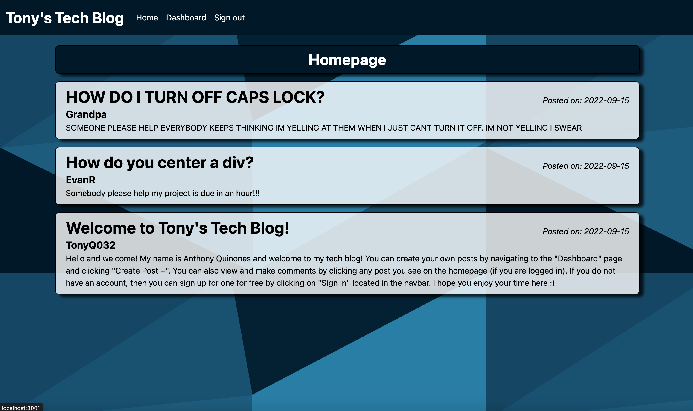
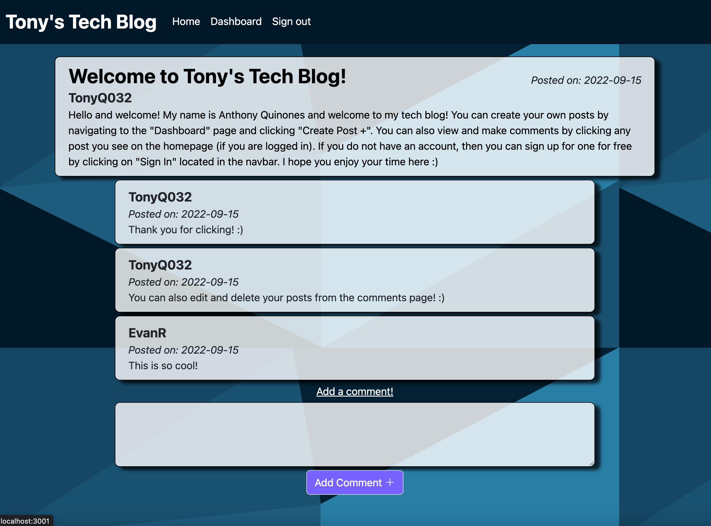
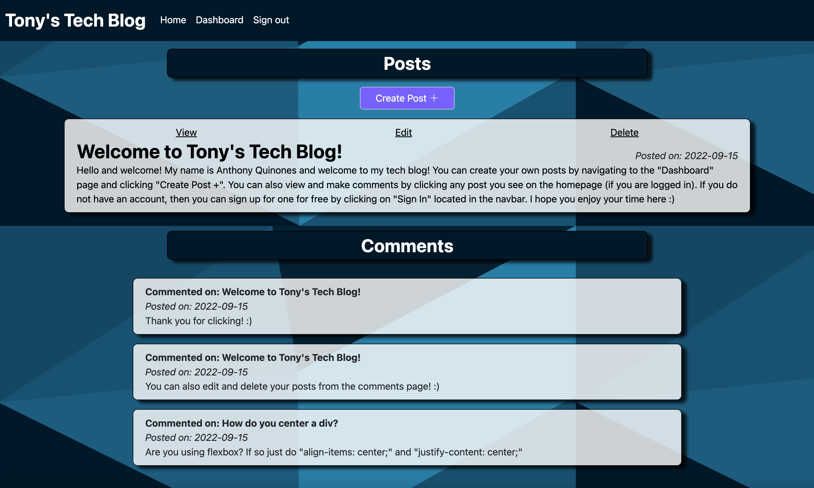
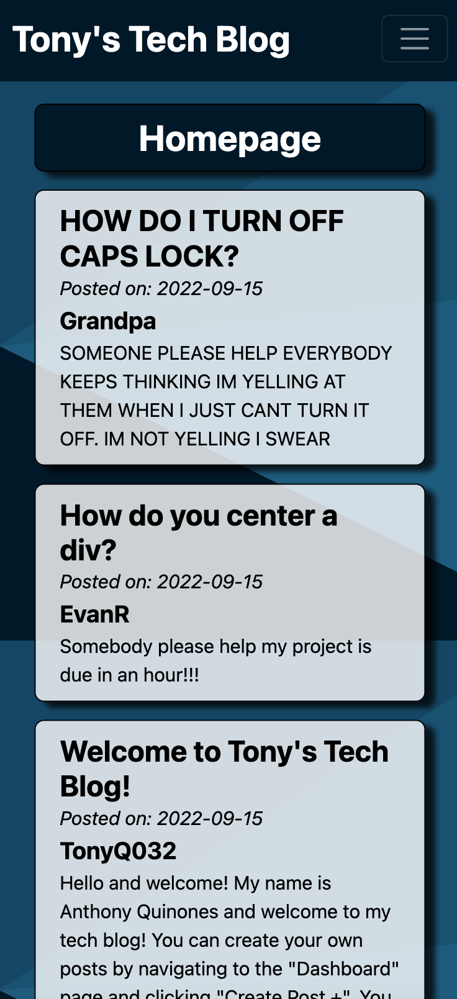
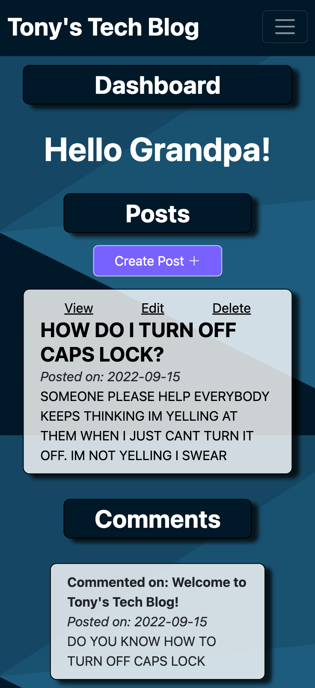

# Tonys-Tech-Blog
A full-stack tech blog application!

## Description
The purpose of this project was to build a complete, full-stack web application that demonstrates many of the skills I have acquired over the last few months from my coding bootcamp. The website is a CMS-style blog site similar to a Wordpress site, where developers can publish their blog posts and comment on other developers’ posts as well. 

It is a fully dynamic, responsive website run primarily by `Node.js`, `Express.js`, `MySQL`, and `Express-Handlebars`. The project also utilizes `bcrypt` for safely hashing user's passwords before it is even entered into the database. It also utilizes `Express-Session` for creating sessions and cookies. A session will last 15 minutes, after which, the user will be logged out and have to log back in.

For a full list of the various libraries, packages, and technologies utilized for this project, please refer to the [Technologies](#technologies) section below. 

This project is currently hosted on Heroku and be accessed by clicking [here.](https://tony-tech-blog.herokuapp.com/)

-------------------------

## Table of Contents
* [How to use](#how-to-use)
* [Installation](#installation)
* [Technologies](#technologies)
* [Screenshots](#screenshots)
* [License](#license)
* [Questions](#questions)

-------------------------
## How to use
You can create your own posts by navigating to the "Dashboard" page and clicking "Create Post +". You can also view and make comments by clicking any post you see on the homepage (if you are logged in). If you do not have an account, then you can sign up for one for free by clicking on "Sign In" located in the navbar.

-------------------------

## Installation
If you wish to clone this repo and host the website locally, please be sure to carefully follow the installation instructions.

1. This app is powered by Node.js and MySQL, as a result, make sure those are properly installed and configured before continuing on.
2. Navigate to the root of this repo and run `npm install` in your console/terminal to download all the necessary npm packages.
3. Create a `.env` file in the root of the repo. Within this file, copy and paste the following: 

```md
DB_NAME=blog_db
DB_USER=<user_name>
DB_PASSWORD=<user_password>
```
*Alternatively, you can modify the included `.env.EXAMPLE` file to include your username and password*

4. Change the value of `DB_USER` and `DB_PASSWORD` to your MySQL user and password respectively. Save these changes.
5. Execute `mysql -u root -p` in your console/terminal.
6. Once succesfully logged in, execute `source db/schema.sql` to create database. Exit when finished.
7. You are now ready to turn on the server by running `npm start` or `npm run watch` for nodemon (to view changes live).

*By default, the server is hosted to `http://localhost:3001/` although the PORT number can be modified by changing the value of the variable `PORT` in `server.js` on `line 13`.*

-------------------------

## Technologies
Below is a list of all the technologies we utilized in order to build this website.

### NPM Packages
* [BCrypt](https://www.npmjs.com/package/bcrypt)
* [Connect-Session-Sequelize](https://www.npmjs.com/package/connect-session-sequelize)
* [Dotenv](https://www.npmjs.com/package/dotenv)
* [Express](https://www.npmjs.com/package/express)
* [Express-Handlebars](https://www.npmjs.com/package/express-handlebars)
* [Express-Session](https://www.npmjs.com/package/express-session)
* [MySQL2](https://www.npmjs.com/package/mysql2)
* [Sequelize](https://www.npmjs.com/package/sequelize)

### Other Technologies (CDNs)
* [Bootstrap](https://getbootstrap.com)
* [Sweet Alert](https://sweetalert.js.org)

-------------------------

## Screenshots

Below are various screenshots of the website:

### Homepage on PC


### Individual comment on PC


### Dashboard on PC


### Homepage & Dashboard on Mobile
<div style="display: flex;"> 





</div>

-------------------------

## License

This project falls under the following license:
* [MIT](https://opensource.org/licenses/MIT)

-------------------------

## Questions
If you have any questions or comments, please feel free to contact me below: 

### Anthony Quinones
Github: [TonyQ032](https://github.com/TonyQ032) 

LinkedIn: [Anthony Quinones](https://www.linkedin.com/in/anthony-quinones/)

Email: anthonyq032@gmail.com
